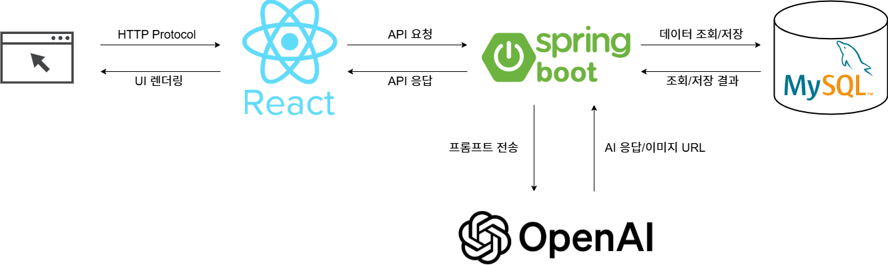

# 걷기가 서재 - "작가의 산책"

> 🗂️ 이 레포지토리는 백엔드 전용 저장소입니다.

## 📌 서비스 소개

"**작가의 산책**"은 누구나 작가가 되어 자유롭게 글을 집필하고 공개할 수 있는 창작 플랫폼입니다.  
이 서비스는 **작가의 감성과 이야기가 그대로 표지에 닿도록 설계된 표지 제작 기능**을 중심으로,  
**기획자에게 가장 가까운 창작자의 시선**을 제공합니다.

## 🗂 시스템 아키텍처



## 🛠️ 기술 스택

### 💻 백엔드
- Java
- Spring Boot
- Spring MVC (REST API)
- Spring Data JPA
- Lombok

### 🖥️ 프론트엔드
- JavaScript (ES6+)
- React
- Axios
- React Router
- Material-UI (MUI)

### 🗃️ 데이터베이스
- H2 (개발용)
- MySQL

### 🔗 API
- RESTful API
- OpenAI API (DALLE)

## 📦 주요 기능
```markdown
## 📚 책 관리 API

```java
@GetMapping(value = "/books") //전체 목록 조회
public ResponseEntity<?>  getBookList() {
  return new ResponseEntity<>(bookService.getBookList(), HttpStatus.OK);
}

@GetMapping(value = "/books-detail") //상세 정보 조회
public ResponseEntity<?> getBookDetailInfo( @RequestParam("id") Long id) {
  return new ResponseEntity<>(bookService.getBookDetailInfo(id), HttpStatus.OK);
}

@GetMapping (value = "/books-author")  // 저자 정보 조회
public ResponseEntity<?> getBooksByAuthorName( @RequestParam("author") String author) {
  return new ResponseEntity<>(bookService.getBooksByAuthorName(author), HttpStatus.OK);
}

@DeleteMapping(value = "/books") //책 정보 삭제
public ResponseEntity<?> deleteBook(@RequestBody BookIdDto bookIdDto){
  bookService.deleteBook(bookIdDto);
  return new ResponseEntity<>("delete success",HttpStatus.OK);
}

@PostMapping(value = "/books") //책 정보 등록
public ResponseEntity<?> registBook(@RequestBody SaveBookInfoDto saveBookInfoDto){
  bookService.registBook(saveBookInfoDto);
  return new ResponseEntity<>("regist success",HttpStatus.OK);
}

@PutMapping(value = "/books") //책 정보 수정
public ResponseEntity<?> updateBook(@RequestBody UpdateBookDto updateBookDto){
  bookService.updateBook(updateBookDto);
  return new ResponseEntity<>("hello",HttpStatus.OK);
}

- 프롬프트 기반 이미지 생성 (DALL·E 3 사용)
- 이미지 생성 여부 Boolean 값으로 제어
- 도서 정보 CRUD
- 저자/제목 검색 기능 지원
- 정렬 기능: 최신순 / 인기순
- 
## 👥 팀원 소개

| 이름     | 역할               |
|----------|--------------------|
| 박동근   | PM (Project Manager) |
| 김태현   | Frontend Developer |
| 김해연   | Frontend Developer |
| 배소연   | Frontend Developer |
| 이상엽   | Frontend Developer |
| 김민수   | Backend Developer  |
| 조승빈   | Backend Developer  |


